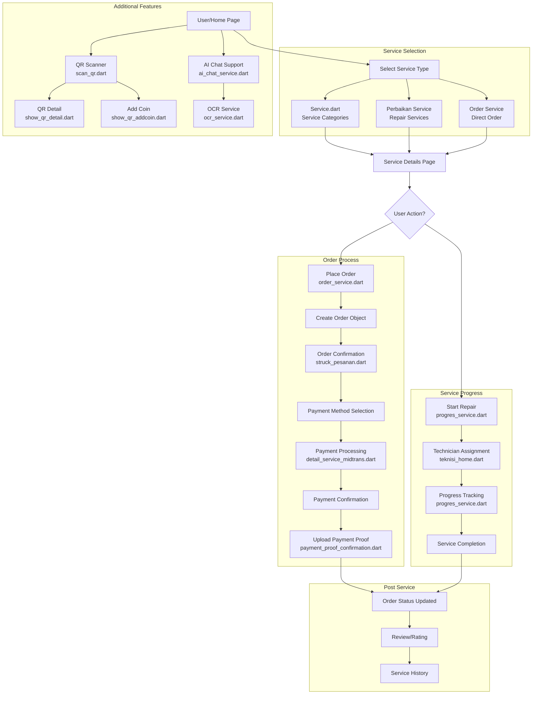
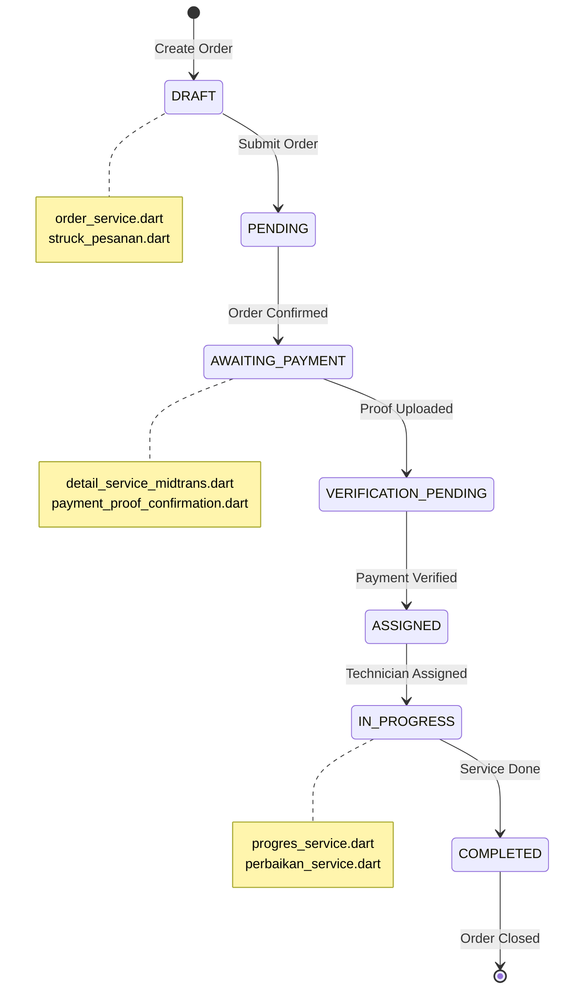

# Service Ordering Process - Scenario Diagram

---

## Detailed Flow Steps

### 1. **Service Browsing** (`lib/Service/Service.dart`)
   - User views available service categories
   - Selects desired service type

### 2. **Order Placement** (`lib/Service/order_service.dart`)
   - User fills order details
   - Creates new order record
   - Redirects to order confirmation

### 3. **Order Confirmation** (`lib/Others/struck_pesanan.dart`)
   - Displays order summary
   - Shows payment instructions

### 4. **Payment Processing** (`lib/Service/detail_service_midtrans.dart`)
   - Integrates with Midtrans payment gateway
   - Handles payment transactions

### 5. **Payment Proof** (`lib/Others/payment_proof_confirmation.dart`)
   - User uploads payment proof
   - Admin verifies payment

### 6. **Service Progress** (`lib/Service/progres_service.dart`)
   - Technician assigned
   - Status tracked (pending → processing → completed)

### 7. **Repair Service Flow** (`lib/Service/perbaikan_service.dart`)
   - Specific flow for repair services
   - Includes damage assessment

### 8. **Admin/Store** (`lib/Admin/instore_transaction.dart`)
   - Admin manages transactions
   - Tracks in-store orders

### 9. **QR Features** (`lib/Profile/scan_qr.dart`, `show_qr_detail.dart`, `show_qr_addcoin.dart`)
   - QR code scanning
   - Coin/reward system

### 10. **AI & OCR** (`lib/services/ai_chat_service.dart`, `ocr_service.dart`)
    - AI chat assistant
    - OCR for document/image processing

---

## User Roles Interactions

| Role | Actions | Files Involved |
|------|---------|----------------|
| **Customer** | Browse, Order, Pay, Track, Review | order_service.dart, progres_service.dart |
| **Technician** | Accept, Process, Complete Service | teknisi_home.dart, progres_service.dart |
| **Admin** | Manage Orders, Verify Payment, Confirm | instore_transaction.dart, payment_proof_confirmation.dart |
| **System** | AI Support, QR Processing, OCR | ai_chat_service.dart, ocr_service.dart |

---

## State Transition Diagram

