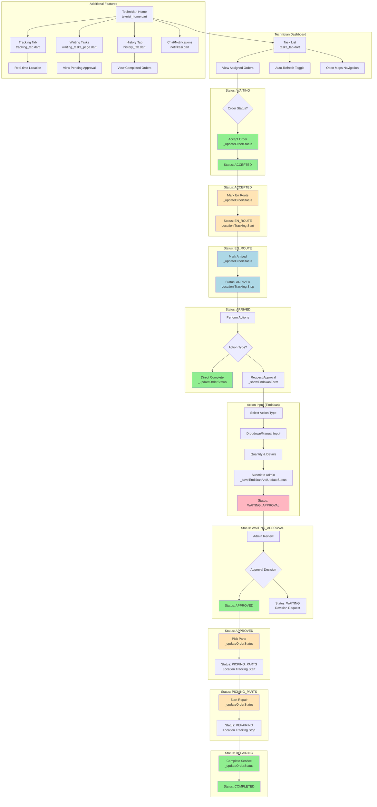
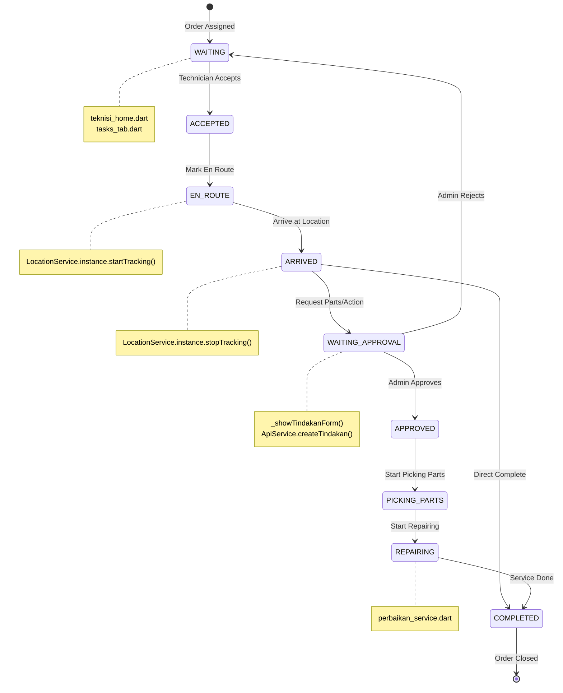

# Technician Update Repair Status - Scenario Diagram

---

## Status Transition Flow

---

## Detailed Flow Steps

### 1. **Technician Dashboard** (`lib/Teknisi/teknisi_home.dart`)
   - View assigned orders list
   - Auto-refresh toggle (every 4 seconds)
   - Notification for new orders

### 2. **Accept Order** (`_updateOrderStatus`)
   - Technician accepts pending order
   - Validates status transition: WAITING → ACCEPTED

### 3. **En Route** 
   - Mark as traveling to location
   - Enters status: EN_ROUTE
   - Location tracking starts

### 4. **Arrived**
   - Mark arrival at customer location
   - Enters status: ARRIVED
   - Location tracking stops

### 5. **Action/Tindakan Form** (`_showTindakanForm`)
   - Standard actions: Cleaning, Sparepart Replacement, Calibration, Diagnose, Hardware Repair, Software Update
   - Custom manual input option
   - Quantity and detail inputs

### 6. **Submit for Approval**
   - Technician inputs tindakan details
   - Sends to admin for approval
   - Status changes to WAITING_APPROVAL

### 7. **Admin Decision**
   - Admin reviews requested actions
   - Approve or reject with feedback
   - If approved: status → APPROVED
   - If rejected: status → WAITING (for revision)

### 8. **Pick Parts** (`_updateOrderStatus`)
   - After approval, technician picks up parts
   - Status: PICKING_PARTS
   - Location tracking starts

### 9. **Repairing**
   - Technician performs repair work
   - Status: REPAIRING

### 10. **Complete Service**
   - Technician marks service as done
   - Status: COMPLETED
   - Location tracking stops

---

## Valid Status Transitions

| Current Status | Next Status | Trigger | Location Tracking |
|----------------|------------|---------|-------------------|
| WAITING | ACCEPTED | Accept Order | - |
| ACCEPTED | EN_ROUTE | Mark En Route | Start |
| EN_ROUTE | ARRIVED | Mark Arrived | Stop |
| ARRIVED | COMPLETED | Direct Complete | - |
| ARRIVED | WAITING_APPROVAL | Request Approval | - |
| WAITING_APPROVAL | WAITING | Admin Reject | - |
| APPROVED | PICKING_PARTS | Start Picking | Start |
| PICKING_PARTS | REPAIRING | Start Repair | Stop |
| REPAIRING | COMPLETED | Complete | - |

---

## Files Involved

| File | Description |
|------|-------------|
| `lib/Teknisi/teknisi_home.dart` | Main technician dashboard |
| `lib/Teknisi/tasks_tab.dart` | Task list view |
| `lib/Teknisi/tracking_tab.dart` | Location tracking view |
| `lib/Teknisi/waiting_tasks_page.dart` | Pending approval view |
| `lib/Teknisi/history_tab.dart` | Completed orders history |
| `lib/Teknisi/teknisi_profil.dart` | Technician profile |
| `lib/Service/progres_service.dart` | Service progress tracking |
| `lib/Service/perbaikan_service.dart` | Repair service handling |
| `lib/api_services/api_service.dart` | API communication |

---

## User Actions Summary

| Action | Method | File |
|--------|--------|------|
| View Assigned Orders | `_refreshData()` | teknisi_home.dart |
| Accept Order | `_updateOrderStatus(order, ACCEPTED)` | teknisi_home.dart |
| Mark En Route | `_updateOrderStatus(order, EN_ROUTE)` | teknisi_home.dart |
| Mark Arrived | `_updateOrderStatus(order, ARRIVED)` | teknisi_home.dart |
| Input Action Details | `_showTindakanForm()` | teknisi_home.dart |
| Submit for Approval | `_saveTindakanAndUpdateStatus()` | teknisi_home.dart |
| Pick Parts | `_updateOrderStatus(order, PICKING_PARTS)` | teknisi_home.dart |
| Start Repair | `_updateOrderStatus(order, REPAIRING)` | teknisi_home.dart |
| Complete Service | `_updateOrderStatus(order, COMPLETED)` | teknisi_home.dart |
| View on Maps | `_openMaps()` | teknisi_home.dart |